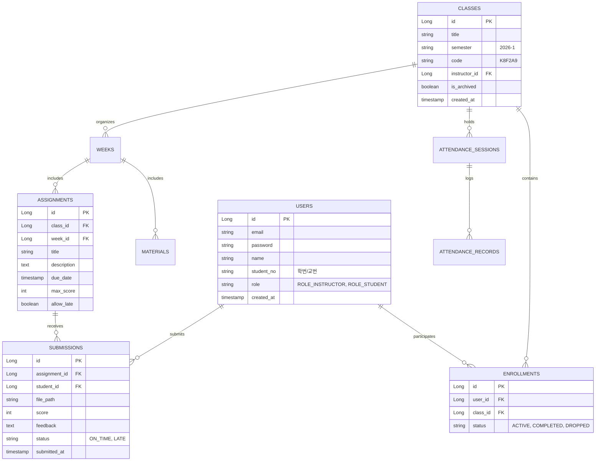

# 📘 프로젝트 기획서 (PRD: Product Requirements Document)

## 프로젝트명: UniClass (Java / Spring Boot 기반 차세대 스마트 수업 플랫폼)

---

## 1. 프로젝트 개요

### 1.1 배경 및 목적
* **자료 공유 파편화 해결**: 카카오톡, 이메일, USB 등으로 흩어진 강의 자료를 1~16주차별로 일원화.
* **과제 및 피드백 자동화**: 마감 시간 자동 판별, 지각 제출 관리, 웹 브라우저 내 즉시 채점(Speed Grader).
* **교수 강의 준비 부담 경감**: 작년 동학기 수업 원클릭 복제, 4자리 간편 출석, AI 커리큘럼 보조.
* **학기 종료 후 데이터 보존**: 데이터 삭제 없는 안전한 아카이빙(읽기 전용) 및 학생 포트폴리오 다운로드.

---

## 2. 사용자 역할 및 권한 체계 (Spring Security Roles)

| 역할 (Role) | 설명 | 주요 권한 |
| :--- | :--- | :--- |
| **`ROLE_INSTRUCTOR`** (교수) | 수업을 개설하고 총괄하는 사용자 | 수업 생성/수정/보관, 자료 등록, 과제 출제, 최종 성적 관리 |
| **`ROLE_TA`** (조교) | 교수의 수업 운영을 보조하는 사용자 | 실습 자료 등록, 과제 채점 및 피드백 작성 (수업 보관/삭제 불가) |
| **`ROLE_STUDENT`** (학생) | 수업에 참여하여 학습하는 사용자 | 초대 코드로 참여, 자료 열람/다운로드, 과제 제출, 피드백 확인 |
| **`ROLE_ALUMNI`** (수료/졸업생) | 해당 학기를 마친 사용자 | 지난 수업 읽기 전용(Read-only) 열람, 포트폴리오 ZIP 다운로드 |

---

## 3. 전체 핵심 기능 명세

### 3.1 회원가입 및 수강 관리 (Auth & Enrollment)
* **회원가입/로그인**: 이메일, 비밀번호, 실명, **학번/교번(필수)** 수집
* **수업 생성**: 교수자가 수업명, 학기(예: 2026-1), 분반, 수강 정원 입력 후 생성
* **초대 코드 시스템**: 수업마다 고유한 6자리 영문/숫자 코드 자동 생성 (예: `K8F2A9`)
* **학생 참여**: 학생은 초대 코드를 입력하여 1초 만에 수강 등록

### 3.2 주차별 강의 자료실 (Course Materials)
* **주차별 섹션 구조**: 1주차~16주차 블록 구조로 자료 체계화
* **파일 첨부/다운로드**: PDF, PPT, Word, 소스코드(ZIP) 등 업로드 (파일당 20MB 제한)
* **예약 발행**: 특정 일시(예: 매주 월요일 오전 9시)에 자료 자동 공개
* **강의실 모드 (Presentation Mode)**: 교탁 PC에서 별도 프로그램 없이 브라우저 전체화면으로 슬라이드 쇼 진행

### 3.3 과제 관리 및 스피드 채점 시스템 (Assignments & Speed Grader)
* **과제 출제**: 과제 제목, 설명, 마감 일시(Deadline), 배점, 지각 제출 허용 여부 설정
* **학생 제출 인터페이스**:
  * 상태 구분: **`미제출`**, **`제출 완료`**, **`지각 제출 (Late)`** 자동 판별
  * 마감 전 자유로운 재제출 지원 (최종 제출본 기준 기록)
* **스피드 그레이더 (Speed Grader)**:
  * 학생별 제출물을 다운로드하지 않고 웹 브라우저 내에서 즉시 뷰어로 확인
  * 점수 입력창 및 루브릭(채점 기준표) 체크박스 지원, 개별 피드백 코멘트 작성
* **원클릭 미제출자 독려 (Nudge)**: 마감 24시간 전 미제출자들에게 일괄 리마인드 알림 발송

### 3.4 실시간 4자리 간편 출석 체크 (Realtime Attendance)
* **4자리 인증번호 출석**:
  * 교수 화면에 3분간 유효한 4자리 랜덤 숫자 팝업 생성
  * 학생은 모바일/PC로 접속해 번호 입력 즉시 출석 처리
  * 실시간으로 출석자/지각자 현황 집계

### 3.5 강의 준비 지원 도우미 (Course Copilot)
* **수업 및 과제 복제**: 작년 동학기(1년 전) 수업 데이터를 그대로 복제하며 개강일에 맞춰 일정 자동 재설정
* **개인 자료 보관함 (My Library)**: 수업이 끝나도 교수 계정에 영구 보관되는 자료 창고
* **AI 커리큘럼 초안 생성**: 과목 키워드 입력 시 16주차 커리큘럼 및 추천 교재/학습 목표 초안 생성

### 3.6 학기 종료 및 데이터 보존 (Lifecycle & Archiving)
* **수업 보관(Archive)**: 학기 종료 시 수업을 삭제하지 않고 '보관' 처리하여 '읽기 전용' 동결
* **학생 포트폴리오 다운로드**: 종강 시 학생이 본인이 제출한 과제와 교수 피드백을 ZIP으로 일괄 다운로드

---

## 4. 데이터베이스 ERD 구조 (JPA Entity)

---

## 5. 자바(Java) 기반 권장 기술 스택

* **언어**: Java 21 / 25 (LTS)
* **백엔드 프레임워크**: **Spring Boot 3.x**
* **보안 및 인증**: **Spring Security** (세션 기반 인증)
* **데이터베이스 및 ORM**: **Spring Data JPA (Hibernate)** + H2 Database (개발용 내장 DB) / PostgreSQL or MySQL (배포용)
* **화면 렌더링 (UI)**: **Thymeleaf + Tailwind CSS + Vanilla JS**
  * *장점: 별도의 복잡한 Node.js/React 빌드 서버 없이 `gradlew bootRun` 하나로 전체 프론트/백엔드가 바로 동작하여 가장 가볍고 토큰을 아낄 수 있음*
* **파일 저장소**: Spring `MultipartFile` 로컬 디렉토리 저장소 (추후 S3 연동 가능)
